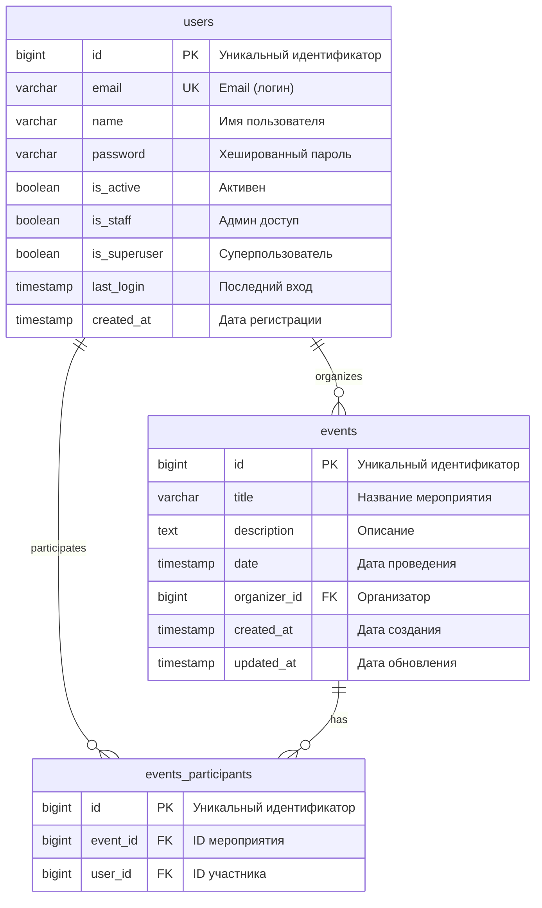

# ER-диаграмма базы данных

## Визуализация в Mermaid



## Описание связей

### 1. users → events (One-to-Many)
**Тип:** One-to-Many  
**Описание:** Один пользователь может организовать множество мероприятий  
**FK:** `events.organizer_id` → `users.id`  
**ON DELETE:** CASCADE (при удалении пользователя удаляются его мероприятия)

### 2. events ↔ users через events_participants (Many-to-Many)
**Тип:** Many-to-Many  
**Описание:** Одно мероприятие может иметь много участников, один пользователь может участвовать во многих мероприятиях  
**FK1:** `events_participants.event_id` → `events.id`  
**FK2:** `events_participants.user_id` → `users.id`  
**ON DELETE:** CASCADE (при удалении мероприятия или пользователя удаляются связи)  
**UNIQUE:** (`event_id`, `user_id`) - пользователь может зарегистрироваться на мероприятие только один раз

## Индексы

### Таблица users
- `PRIMARY KEY` на `id`
- `UNIQUE INDEX` на `email`
- `INDEX` на `is_active`

### Таблица events
- `PRIMARY KEY` на `id`
- `INDEX` на `date` (для быстрого поиска предстоящих мероприятий)
- `INDEX` на `organizer_id` (для быстрого поиска мероприятий пользователя)
- `INDEX` на `created_at`

### Таблица events_participants
- `PRIMARY KEY` на `id`
- `UNIQUE INDEX` на (`event_id`, `user_id`) - предотвращает дублирование регистраций
- `INDEX` на `event_id`
- `INDEX` на `user_id`

## Constraints (ограничения)

1. **users.email** - UNIQUE, NOT NULL
2. **events.organizer_id** - NOT NULL, FOREIGN KEY
3. **events_participants.(event_id, user_id)** - UNIQUE TOGETHER
4. **CASCADE DELETE** для всех внешних ключей

## Примеры запросов

### Получить все мероприятия пользователя как организатора
```sql
SELECT * FROM events 
WHERE organizer_id = 1 
ORDER BY date DESC;
```

### Получить все мероприятия, на которые зарегистрирован пользователь
```sql
SELECT e.* 
FROM events e
INNER JOIN events_participants ep ON e.id = ep.event_id
WHERE ep.user_id = 1
ORDER BY e.date ASC;
```

### Получить всех участников мероприятия
```sql
SELECT u.* 
FROM users u
INNER JOIN events_participants ep ON u.id = ep.user_id
WHERE ep.event_id = 1;
```

### Получить предстоящие мероприятия с количеством участников
```sql
SELECT 
    e.*,
    u.name as organizer_name,
    COUNT(ep.user_id) as participants_count
FROM events e
LEFT JOIN users u ON e.organizer_id = u.id
LEFT JOIN events_participants ep ON e.id = ep.event_id
WHERE e.date >= NOW()
GROUP BY e.id, u.name
ORDER BY e.date ASC;
```

## Статистика схемы

- **Таблиц:** 3 (основных) + 3 (Django служебные)
- **Связей:** 3 (1 One-to-Many + 2 для Many-to-Many)
- **Индексов:** 11
- **Constraints:** 5

## Нормализация

База данных находится в **3NF (Third Normal Form)**:
- ✅ Нет повторяющихся групп (1NF)
- ✅ Все неключевые атрибуты полностью зависят от первичного ключа (2NF)
- ✅ Нет транзитивных зависимостей (3NF)
